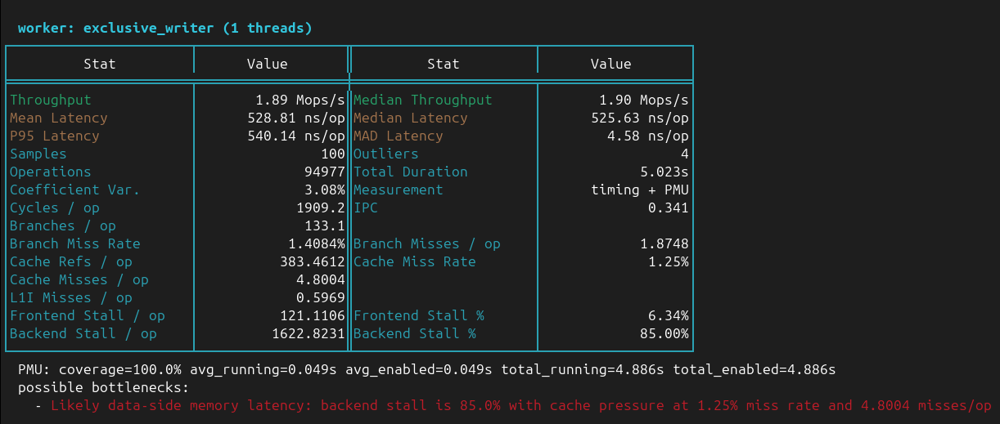

# micromeasure

`micromeasure` is a microbenchmark harness for Rust for systems work where timing alone is not enough information.

[](https://crates.io/crates/micromeasure)
[](https://docs.rs/micromeasure)
[](./LICENSE)
[](https://github.com/sponsors/rdaum)

It is aimed at very focused operations where you care about instruction count, branch predictor behaviour, cache misses,
and operation latency.

It grew out of the needs of my [`mooR`](https://codeberg.org/timbran/moor) project, where many of the interesting
questions were about tiny operations and internal data-structure mechanics. The goal was to measure things like:

- what changed in the instruction count for something as small as `1 + 1` on a custom value type?
- did a small change in an internal data structure alter branch predictor behaviour?
- did cache misses move for a tight lookup or mutation path?
- did a micro-operation get noisier even if mean elapsed time barely moved?

That means:

- direct Linux perf counter (PMU) integration as a first-class feature
- simple hand-written microbench drivers, not macro-heavy harness structure
- output that emphasizes instruction count, branch behaviour, cache misses, and timing together
- benchmark binaries that can be filtered and run directly during systems work
- persisted raw samples so you can compare a current run against the last compatible run immediately

> If `micromeasure` is useful in your work, consider sponsoring development on GitHub Sponsors.
> I am also available for consulting in systems engineering, profiling and performance tuning, and
> Rust development (10 years at Google, 25+ years in software development). 
> If this project is useful or interesting for your team, feel free to reach out.

## ... but why not Criterion?

Criterion is a strong general-purpose Rust benchmarking library. It has the bulk of ecosystem mindshare, better polished
statistical analysis, and a mature presentation story. This crate is narrower.

Use this crate when:

- you are tuning very small operations and want PMU-derived metrics beside latency/throughput
- you want to inspect instruction count, branch misses, cache misses, and timing in one report
- you are working on internal value operations, cache lookups, symbol tables, allocators, or similar hot paths
- you want a small custom benchmark binary that you control directly
- you want immediate "last run vs this run" output from persisted sample data

Use Criterion when:

- you want a polished general-purpose benchmark framework
- you want richer out-of-the-box statistical analysis and reporting
- you want HTML reports and the broader Criterion workflow
- PMU metrics are not the main reason you are benchmarking

One concrete difference is Linux perf integration. Criterion perf integrations are generally measurement plugins, which
means a given run tends to be centred on one selected perf event. The use case here is different: collect timing,
throughput, and multiple PMU-derived metrics together in one run so you can see whether a tiny operation changed
latency, instruction count, branch misses, and cache-miss behaviour at the same time.

It's possible I missed the right knobs to make criterion do what I need, but this has suited me well-ish, so far, so I
am sharing it.

## Current focus

`micromeasure` currently emphasizes:

- timing and throughput
- median, p95, MAD, coefficient of variation, and outlier counts
- coordinated concurrent microbenchmarks with the same sample/report pipeline
- Linux perf counters when available
- graceful fallback to timing-only runs when PMU access is unavailable
- persisted benchmark reports with per-sample throughput and latency series
- side-by-side comparison against the latest compatible saved report

## Wiring It Up

Add `micromeasure` as a dev-dependency:

```toml
[dev-dependencies]
micromeasure = "0.2"
```

Then add a custom bench target in your `Cargo.toml`:

```toml
[[bench]]
name = "basic"
harness = false
```

That bench target usually lives at `benches/basic.rs`.

For the bench entrypoint itself, prefer the shared launcher instead of hand-rolling argument
parsing, report printing, and result persistence in every benchmark binary.

## Example

For a standalone example in this repository, run:

```sh
cargo run --example basic --release
```

For a concurrent workload example, run:

```sh
cargo run --example concurrent_scenario --release
```

For a concurrent workload example with bench-defined event counters, run:

```sh
cargo run --example concurrent_counters --release
```

In a consuming crate, you would usually run your benchmark with:

```sh
cargo bench --bench basic
```

Example output:



```rust
use micromeasure::{NoContext, benchmark_main, black_box};

fn add_bench(_ctx: &mut NoContext, chunk_size: usize, _chunk_num: usize) {
    let mut acc = black_box(0_u64);
    let limit = black_box(chunk_size as u64);
    for i in 0..limit {
        acc = acc.wrapping_add(black_box(i));
    }
    black_box(acc);
}

benchmark_main!(|runner| {
    runner.group::<NoContext>("Arithmetic", |g| {
        g.bench("add_loop", add_bench);
    });
});
```

`benchmark_main!` handles:

- parsing an optional benchmark filter from the command line
- constructing `BenchmarkRunner` with that filter
- printing the session summary
- saving the report to the default location

If you want a custom suite name or custom filter help text, use
`run_benchmark_main(BenchmarkMainOptions { ... }, |runner| { ... })` instead.

## Concurrent Benchmarks

`micromeasure` can also benchmark coordinated concurrent workloads while still using the same
sample-driven measurement pipeline as the single-threaded path.

That means concurrent benchmarks still get:

- the usual sample count and calibration flow
- the usual timing statistics
- Linux PMU counters when available
- persisted `BenchmarkResult` data and normal session summaries

The difference is the shape of one sample: instead of one function running on one thread, a sample
runs multiple worker roles against shared state for a fixed sample window.

Use this when the thing you care about only shows up under contention, for example:

- cache misses caused by reader/writer interference
- branch miss behaviour in optimistic retry loops
- lock or latch implementations under mixed access patterns

The concurrent API is centered on:

- `ConcurrentBenchContext`
- `ConcurrentWorker`
- `ConcurrentBenchControl`
- `ConcurrentWorkerResult`
- `BenchmarkRunner::concurrent_group(...)`

See [examples/concurrent_scenario.rs](./examples/concurrent_scenario.rs) for a complete
reader/writer contention benchmark using `ConcurrentBenchContext` and
`BenchmarkRunner::concurrent_group(...)`.

If a concurrent benchmark needs to report scenario-specific events such as retries, failed
try-locks, dropped work, or backoffs, workers can return `ConcurrentWorkerResult` instead of
just an operation count. These event counters are intended to be:

- worker-local plain integers in the hot loop
- packaged once at the end of the sample
- aggregated by worker role after join

That keeps event reporting out of the measured hot path. The framework reports them under each
worker role as `bench event counters`, including total count, per-operation rate, and per-second
rate.

See [examples/concurrent_counters.rs](./examples/concurrent_counters.rs) for a complete
concurrent benchmark that reports bench-defined event counters.

In concurrent output, worker-role tables are the primary view. Each worker role gets the same
stats table shape as the normal benchmark path, including throughput, latency, and PMU-derived
metrics like instructions/op, branch misses, and cache misses.

The `workers combined` section at the bottom is a whole-scenario aggregate. It is mainly useful as
the PMU view of the entire interacting workload; the worker-role tables are usually the more
meaningful place to interpret throughput and latency.

## Linux-first, and why

This crate is strongly Linux-specific, as its main differentiator is direct integration with Linux perf events and PMU
counters. The timing side of the crate is portable enough, but the most important measurements here are things like:

- instructions retired
- branch instructions
- branch misses
- cache misses

If those counters are not available, the crate still runs and still reports timing data, but you are only getting part
of what it is designed for.

If your primary goal is portable benchmarking across platforms, Criterion is usually the better fit.

It is probably feasible to add similar support for other platforms over time, including Darwin/macOS, but that work has
not been done here. I do not have a Mac to develop and validate that path myself, so the crate is currently designed
and tested with Linux as the primary target.

### Enabling perf counters on Linux

On many Linux systems, unprivileged access to perf events is restricted by `kernel.perf_event_paranoid`.

The common cases are:

- `-1` or `0`: broad access
- `1` or `2`: common developer-friendly settings
- `3` or `4`: often too restrictive for useful PMU access in normal user sessions

You can inspect the current setting with:

```sh
cat /proc/sys/kernel/perf_event_paranoid
```

To lower it temporarily until reboot:

```sh
sudo sysctl kernel.perf_event_paranoid=2
```

To make it persistent:

```sh
echo 'kernel.perf_event_paranoid=2' | sudo tee /etc/sysctl.d/99-micromeasure.conf
sudo sysctl --system
```

Depending on your environment, you may also need one of:

- `CAP_PERFMON`
- `CAP_SYS_ADMIN`
- a container/runtime configuration that allows `perf_event_open`

This matters in containers, CI environments, and some locked-down distributions where the kernel setting alone is not
enough.

When PMU access is unavailable, the crate will fall back to timing-only measurement and tell you that it has done so.

## What this crate is not

- not a replacement for Criterion in the general case
- not intended for large end-to-end benchmark suites
- not trying to hide measurement mechanics behind a lot of framework structure
- not a cross-platform PMU abstraction layer

## Origin

This crate started inside `mooR`, a multithreaded MOO server and transactional object database/runtime. Its benchmark
harness grew out of performance work on tiny VM & DB operations, value manipulation, caches, symbol handling, string
processing, and other internal systems paths where the interesting behaviour was often below the level of a conventional
application benchmark.

That origin explains the design bias:

- systems-level microbenchmarks
- direct execution from custom bench binaries
- PMU-aware analysis
- immediate regression visibility while iterating on low-level code

## License

`micromeasure` is licensed under the Apache License, Version 2.0. See [LICENSE](./LICENSE).

Unless explicitly stated otherwise, any contribution intentionally submitted for inclusion in this
project is contributed under the same license.

## Contributing

Contributions are welcome, especially around:

- better statistical analysis and comparison reporting
- improved presentation and terminal output
- additional platform backends for non-Linux systems

If you find defects, I am very interested in hearing about them.

*I am not a professional statistician. It's possible my code is lying to you. If so, please tell me.*
